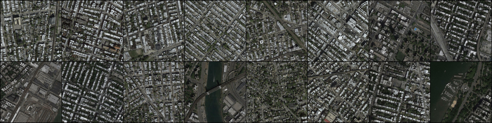
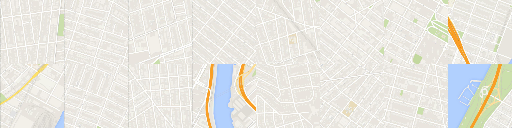
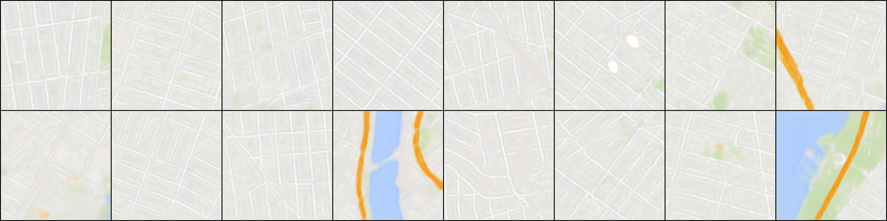
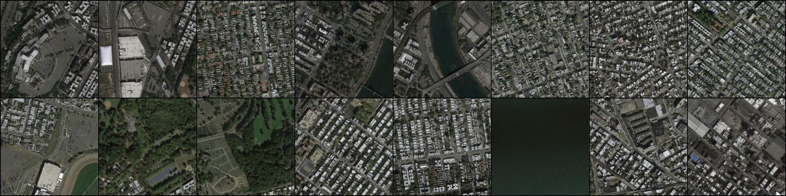
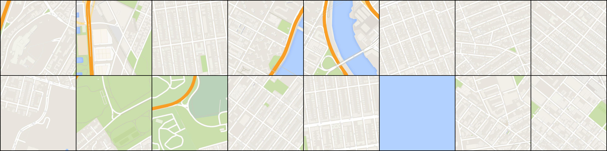

# Semantic Segmentation

## Model

- [U-Net: Convolutional Networks for Biomedical Image Segmentation](https://arxiv.org/abs/1505.04597)
- [FusionNet: A deep fully residual convolutional neural network for image segmentation in connectomics](https://arxiv.org/abs/1612.05360)

## Requirements

- Pytorch 0.1.12
- Python 3.5.2
- wget

## Download code

~~~
git clone https://github.com/GunhoChoi/Kind_PyTorch_Tutorial.git
cd Kind_PyTorch_Tutorial/13_Semantic_Segmentation/
~~~

## Download Map data

~~~
wget https://people.eecs.berkeley.edu/~tinghuiz/projects/pix2pix/datasets/maps.tar.gz
tar -xzvf maps.tar.gz
~~~

## Make required directory

~~~
mkdir model result
~~~

## Arguments

~~~
parser.add_argument("--network",type=str,default="fusionnet",help="choose between fusionnet & unet")
parser.add_argument("--batch_size",type=int,default=1,help="batch size")
parser.add_argument("--num_gpu",type=int,default=1,help="number of gpus")
~~~

## Train Model
~~~
python3 main.py --network unet --batch_size 1 --num_gpu 1
~~~

## Result

### U-net 

Original Image / Label Image / Generated Image

### Fusion-Net

